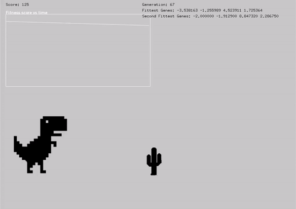

# Chrome Dino Genetic Algorithm

A relatively simple artificial intelligence to teach a computer how to play Chrome Dino from scratch using a simple genetic algorithm.

## Installation

You will need [openFramworks](https://openframeworks.cc/) to run this project.

All necessary resources for graphics and sound have been included in resources.rar

Make sure to install external libraries and dependencies.

### External Libraries Used

You will need to have/install the following:

1. [ofxGraph](https://github.com/TetsuakiBaba/ofxGraph)
2. [ofSoundPlayer](https://openframeworks.cc/ofBook/chapters/sound.html)
3. [Catch2](https://github.com/catchorg/Catch2)

## How Does It Work

### Genetic Algorithm

## Credits

[Introduction to Genetic Algorithms](https://towardsdatascience.com/introduction-to-genetic-algorithms-including-example-code-e396e98d8bf3)